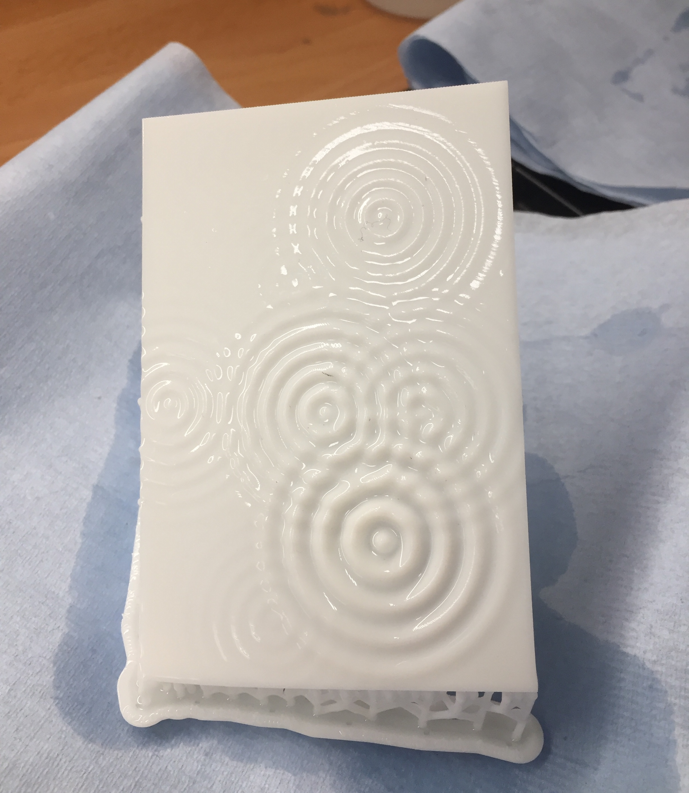
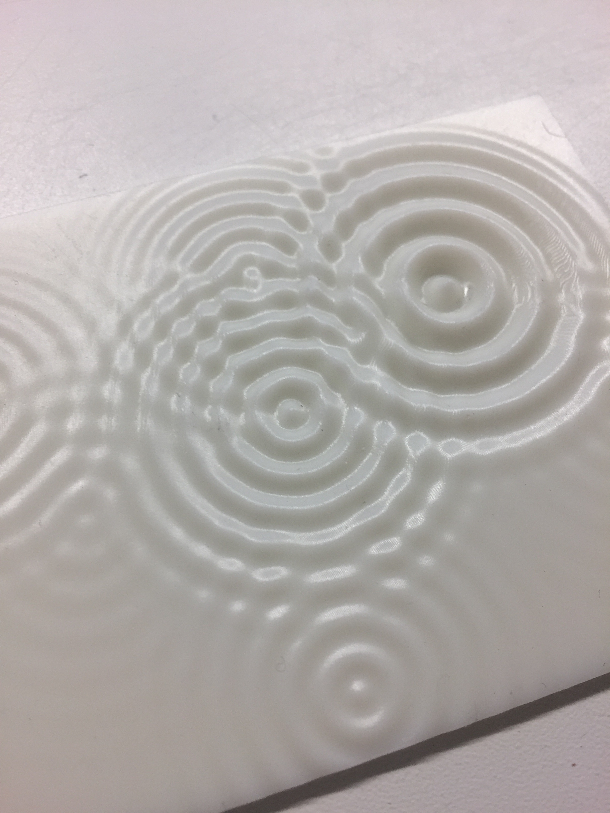

# README 
This project was built using the make system.
To compile it on your machine, import it in the openframeworks project generator and click *Update*.
If the addons below are not added automatically, add them manually from the list.

# Required addons

[ofxImGui](https://github.com/jvcleave/ofxImGui.git)

ofxJSON

# Extras
Additional photos from the final SLA print

